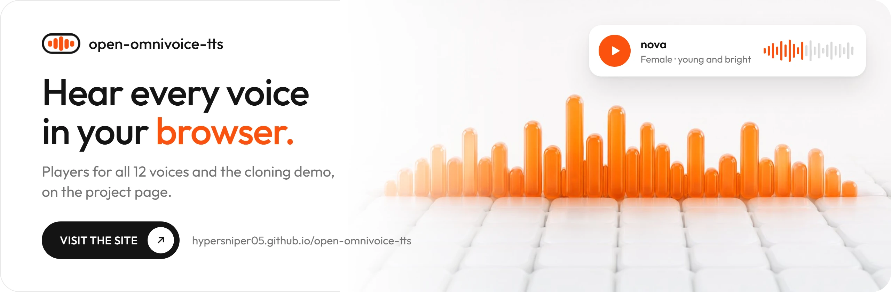

<p align="center">
  <picture>
    <source media="(prefers-color-scheme: dark)" srcset="docs/assets/logo-full-dark.png">
    
  </picture>
</p>

<h1 align="center">OPEN-OMNIVOICE-TTS</h1>

<h3 align="center">A sentence in 0.3 seconds. Any voice, 600+ languages, on your own GPU.</h3>

<p align="center">
  <a href="https://hypersniper05.github.io/open-omnivoice-tts/"></a>
</p>

A self-hosted text-to-speech server with an **OpenAI-compatible API**, built on
[OmniVoice](https://github.com/k2-fsa/OmniVoice), k2-fsa's zero-shot voice cloning model for 600+ languages. It
runs in Docker on an NVIDIA GPU, and any OpenAI client can use it: Open WebUI, LibreChat, SillyTavern,
AnythingLLM, or the `openai` SDKs.

- **OpenAI-compatible** `/v1/audio/speech`: all output formats, `speed`, and all 13 OpenAI voice names
- **Voice cloning** from a 3 to 20 second recording, and **12 open voices** ready to use
- **OpenAI's custom voice API**: create voices from an audio sample or from a description
- **Fast**: 25 to 30 times faster than real time on an RTX 3080, about 3.4 GB of VRAM
- **Interactive API docs** at `/docs`

## Examples

GitHub cannot play audio in a README: click a file to download it, or listen to all of them on the
[project page](https://hypersniper05.github.io/open-omnivoice-tts/).

**Cloning.** Listen to the original, then the clone. The clone says words that were never recorded; everything
else about the voice comes from the 15-second original.

| | Recording | What it says |
|---|---|---|
| **1. Original** | [clone_original.mp3](docs/samples/clone_original.mp3) | "His prospects of success, in pleading for a favorable reception of his brother's message, were so uncertain that he refrained, in fear of raising hopes which he might not be able to justify, from taking Herbert into his confidence." |
| **2. Clone** | [clone_api.mp3](docs/samples/clone_api.mp3) | "This voice was cloned from the recording you just heard. The words are new, but the voice, the pace and the character all come from that one short clip." |

**The bundled voices.** Twelve of OpenAI's voice names come with an openly licensed voice, cloned from LibriVox
readers in [LibriTTS-R](https://www.openslr.org/141/) (credits: [Voices/ATTRIBUTION.md](Voices/ATTRIBUTION.md)):

| Voice | Character | Sample |
|---|---|---|
| `alloy` | female, mid-range | [alloy.mp3](docs/samples/alloy.mp3) |
| `coral` | female, warm and expressive | [coral.mp3](docs/samples/coral.mp3) |
| `marin` | female, natural, conversational | [marin.mp3](docs/samples/marin.mp3) |
| `nova` | female, young and bright | [nova.mp3](docs/samples/nova.mp3) |
| `sage` | female, middle-aged and calm | [sage.mp3](docs/samples/sage.mp3) |
| `shimmer` | female, soft, higher voice | [shimmer.mp3](docs/samples/shimmer.mp3) |
| `ash` | male, young | [ash.mp3](docs/samples/ash.mp3) |
| `ballad` | male, soft and unhurried (also used for `fable`) | [ballad.mp3](docs/samples/ballad.mp3) |
| `cedar` | male, natural and deep | [cedar.mp3](docs/samples/cedar.mp3) |
| `echo` | male, mid-range | [echo.mp3](docs/samples/echo.mp3) |
| `onyx` | male, deep and authoritative | [onyx.mp3](docs/samples/onyx.mp3) |
| `verse` | male, light and expressive | [verse.mp3](docs/samples/verse.mp3) |

## Requirements

| | |
|---|---|
| Docker | Docker Desktop (Windows) or Docker Engine with Compose and the [NVIDIA Container Toolkit](https://docs.nvidia.com/datacenter/cloud-native/container-toolkit/latest/install-guide.html) (Linux) |
| GPU | NVIDIA, at least 6 GB of VRAM recommended; driver 580 or newer. Tested on an RTX 3080 |
| RAM | 16 GB |
| Disk | About 40 GB free for the first start (about 20 GB of it is Docker's build cache: `docker builder prune` frees it) |

Check that Docker can see your GPU:

```bash
docker run --rm --gpus all nvidia/cuda:12.8.2-base-ubuntu24.04 nvidia-smi
```

## Quick start

```bash
git clone --recursive https://github.com/hypersniper05/open-omnivoice-tts.git
cd open-omnivoice-tts
./start.sh            # Linux
```

```powershell
.\start.cmd           # Windows (or double-click start.cmd)
```

The first start builds the Docker image for your GPU (it downloads about 15 GB and takes 10 to 30 minutes),
then downloads the model (about 3 GB). When the server is ready, the script prints:

```
Ready after 95 s. OpenAI-compatible API (no API key):
    base URL   http://localhost:8008/v1
    API docs   http://localhost:8008/docs   (try POST /v1/audio/speech there)
```

Try it:

```bash
curl http://localhost:8008/v1/audio/speech -H "Content-Type: application/json" \
  -d '{"model": "tts-1", "voice": "alloy", "input": "Hello from open-omnivoice-tts."}' --output hello.mp3
```

- **Stop**: `./stop.sh` or `stop.cmd`. **Logs**: `docker compose logs -f`.
- **More than one GPU**: before the first start, copy `.env.example` to `.env` and set `OMNIVOICE_GPU` to the
  `nvidia-smi` number (or UUID) of the card to use. The default is GPU 0.
- **Updates**: after pulling new code, run `./start.sh --build` or `start.cmd -Build`.

> **Security note.** By default there is **no API key**, and the server listens on all network interfaces.
> Set `api_key` in `app/openai_voices.json` before other computers can reach port 8008, use a VPN such as
> Tailscale for remote access, and never forward the port to the internet.

## Connect a client

| Setting | Value |
|---|---|
| Base URL | `http://<host>:8008/v1` |
| API key | anything (or your `api_key`) |
| Model | `tts-1` (any name works) |

```python
from openai import OpenAI

client = OpenAI(base_url="http://localhost:8008/v1", api_key="not-needed")
client.audio.speech.create(model="tts-1", voice="nova", input="Hello.").write_to_file("hello.mp3")
```

**Open WebUI**: *Admin Panel > Settings > Audio*: engine *OpenAI*, base URL `http://<host>:8008/v1`, any key,
model `tts-1`. Other clients: choose OpenAI as the text-to-speech provider and set the same base URL.

## API

| Endpoint | What it does |
|---|---|
| `POST /v1/audio/speech` | Text to speech: `input`, `voice`, `model`, `response_format`, `speed`, `instructions` |
| `GET /v1/models` | Model list |
| `GET`, `POST /v1/audio/voices` | List voices, create a custom voice; `DELETE .../{id}` deletes one |
| `/v1/audio/voice_consents` | Consent recordings for custom voices (as in OpenAI's API) |
| `GET /docs`, `GET /openapi.json` | Interactive docs and the OpenAPI 3.1 description |

- `voice`: a voice name, a file in `Voices/`, a custom voice id, or `design:<attributes>`
  (e.g. `design:female, young adult, british accent`). Also accepted as `{"id": "..."}`.
- `input`: up to 20,000 characters. Tags such as `[laughter]` and `[sigh]` work in the text.
- `response_format`: `mp3` (default), `opus`, `aac`, `flac`, `wav`, `pcm`. `speed`: 0.25 to 4.0.
- Errors use OpenAI's format. A busy server answers 429 or 503 with `Retry-After`. Not supported:
  `stream_format: "sse"`.

## Voices

Put a clip of one speaker (3 to 20 s, little background noise) in `Voices/` and use its file name as the voice.

- **Transcript**: put what the clip says in `<name>.txt` next to it. The clone is better, and the server does
  not need to run Whisper.
- **Silence**: add 0.5 s of silence before the speech and 0.3 s after it; this prevents a breath or blip at the
  start of the speech:
  `ffmpeg -i clip.wav -af "adelay=500:all=1,apad=pad_dur=0.3" -ar 24000 -ac 1 clip_padded.wav`
- **Names**: `app/openai_voices.json` maps voice names to files. Edits apply without a restart.
- **More open voices**: [`tools/pick_libritts_voices.py`](tools/pick_libritts_voices.py) picks clean clips
  from a LibriTTS-R download and writes their credits.

**Custom voices** (OpenAI's voice API) are off by default: set `"allow_custom_voices": true` and an `api_key`
in `app/openai_voices.json`. A voice from a description uses OmniVoice's attributes (gender, age, pitch, style,
accent):

```python
voice = client.audio.voices.create(type="prompt", name="Narrator",
                                   prompt="female, middle-aged, low pitch, british accent")
client.audio.speech.create(model="tts-1", voice={"id": voice.id}, input="Hello.").write_to_file("hello.mp3")
```

A voice from an audio sample needs a consent recording first (`POST /v1/audio/voice_consents`); see `/docs`.

> Only clone voices you have the right to use.

## Configuration

`app/openai_voices.json` (API settings, no restart needed):

| Setting | Default | |
|---|---|---|
| `api_key` | `null` | Require this Bearer token |
| `allow_custom_voices` | `false` | Turn on the custom voice endpoints |
| `voices` | the 13 OpenAI names | Voice name -> file in `Voices/` |
| `generation.num_step` | 16 | Quality vs. speed |

`.env` (server settings; run the start script again after a change):

| Variable | Default | |
|---|---|---|
| `OMNIVOICE_GPU` | 0 | GPU number from `nvidia-smi`, or a UUID |
| `OMNIVOICE_PORT` | 8008 | Port of the API |
| `OMNIVOICE_IDLE_TTL` | 600 | Unload the model after this many idle seconds (0 = never) |
| `OMNIVOICE_MEM_FRACTION` | empty | Cap the model's share of GPU memory, e.g. `0.55` |
| `HF_TOKEN` | empty | Optional Hugging Face token for faster downloads |

Machine-specific Docker settings, such as CPU or RAM limits, go in `docker-compose.override.yml` (git ignores it).

## Performance

RTX 3080, default 16 steps. A sentence is about 4.6 s of speech, a paragraph about 32 s:

| | GPU (RTX 3080) | CPU (4 cores) |
|---|---|---|
| Sentence | 0.34 s | 62 s |
| Paragraph | 1.4 s | 183 s |
| Sentence with voice design | 0.23 s | 13 s |
| First request with a new voice (builds it once) | 6 s, or 14 s without a transcript | 84 to 140 s |

CPU mode (`OMNIVOICE_DEVICE=cpu`) works but is more than 100 times slower. Whisper, which transcribes voices
that have no transcript, had a 1.7% word error rate on the bundled clips.

## Troubleshooting

- **No GPU found**: run the `nvidia-smi` check above. On Linux, install the NVIDIA Container Toolkit.
- **`MissingJITCacheError`**: the image was built for another GPU. Run `start.cmd -Build` or
  `./start.sh --build`. Only RTX 30-series cards have been tested.
- **A breath or blip at the start of the speech**: add silence to the voice's clip (see [Voices](#voices)), or
  use a clip with no breath before the first word.
- **Other computers cannot connect**: use this computer's IP address and allow port 8008 in the firewall.
- **Harmless**: pip's `dependency resolver` error during the build, and the "unauthenticated requests" warning
  while the model downloads.
- **Anything else**: `docker compose logs --tail 100`.

## Credits and licenses

The code in this repository is MIT licensed (see [LICENSE](LICENSE)). Other parts keep their own licenses:

| Part | By | License |
|---|---|---|
| [OmniVoice](https://github.com/k2-fsa/OmniVoice) code (the `vendor/omnivoice-src` submodule) | k2-fsa | Apache-2.0 |
| [OmniVoice model](https://huggingface.co/k2-fsa/OmniVoice) (downloaded on the first start) | k2-fsa | CC BY-NC (**non-commercial**) |
| [LibriTTS-R](https://www.openslr.org/141/) voice clips ([Voices/ATTRIBUTION.md](Voices/ATTRIBUTION.md)) | Koizumi et al., 2023, from LibriVox | CC BY 4.0 |
| [faster-whisper](https://github.com/SYSTRAN/faster-whisper) and [Whisper large-v3-turbo](https://huggingface.co/openai/whisper-large-v3-turbo) | SYSTRAN; OpenAI | MIT |
| [FlashInfer](https://github.com/flashinfer-ai/flashinfer), [Swagger UI](https://github.com/swagger-api/swagger-ui) | FlashInfer team; SmartBear | Apache-2.0 |
| [PyTorch](https://pytorch.org/), [FFmpeg](https://ffmpeg.org/) | PyTorch Foundation; FFmpeg developers | BSD-3-Clause; LGPL / GPL |

The OmniVoice model allows **non-commercial use only**: read its license before you use speech made with it
commercially.
